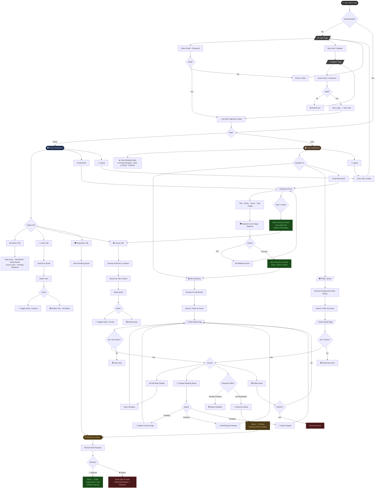

# Athenaeum Archive — End-to-End User Flow

## Complete Flow: Login → All Paths

---

## Quick Reference: Key Decision Points

| Decision | Condition | Outcome |
|----------|-----------|---------|
| `AUTH_CHECK` | JWT Cookie present & valid | Redirect to role dashboard |
| `ROLE_CHECK` | `role === "Admin"` | Admin Dashboard |
| `ROLE_CHECK` | `role === "User"` | User Dashboard |
| `MC_OWNER_CHECK` | `book.userId === currentUser.id` | Edit/Delete/Status controls visible |
| `ADD_SUBMIT` (User) | Role = User | Book saved **Private** |
| `ADD_SUBMIT` (Admin) | Role = Admin | Book saved **Public + Auto-Approved** |
| `MC_REQ_PUB` | `moderationStatus === "Pending"` | Button locked |
| `MOD_DEC → Approve` | Admin clicks Approve | `isApproved=true`, `visibility=Public` |
| `MOD_DEC → Reject` | Admin clicks Reject | `visibility=Private`, `status=Rejected` |

---

*Athenaeum Archive · E2E Flow · v1.0*
