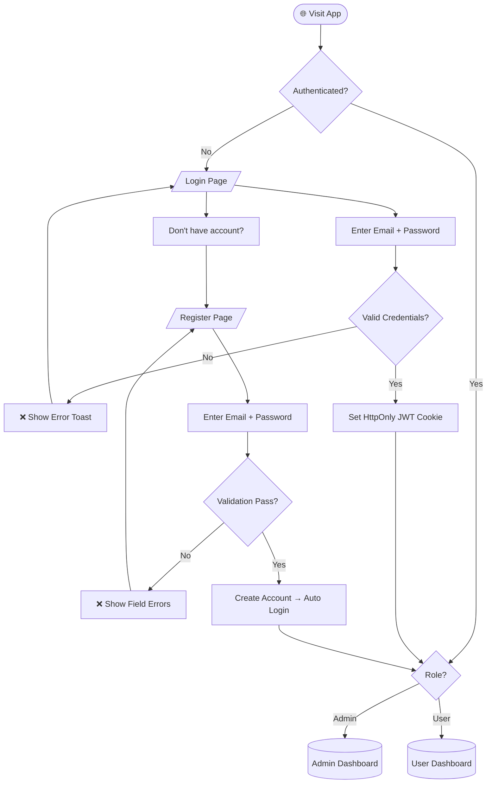
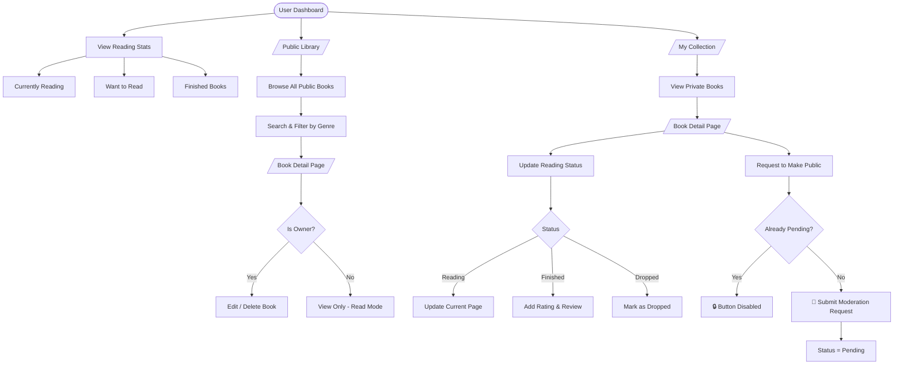
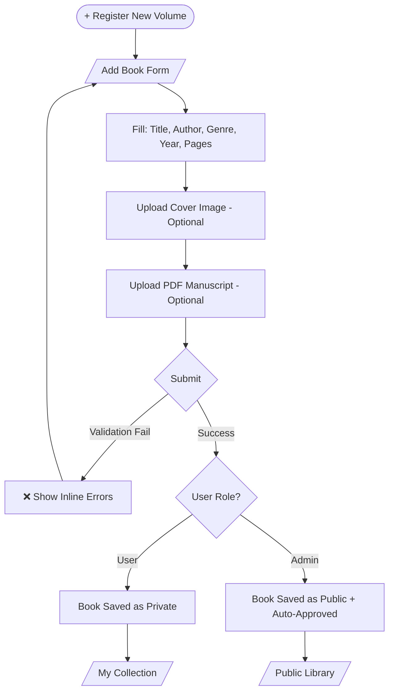
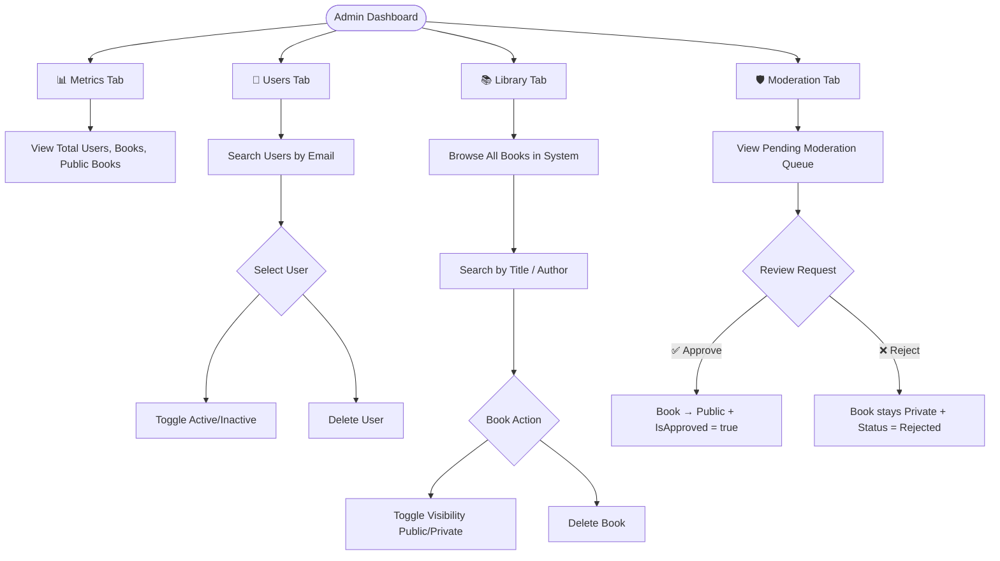
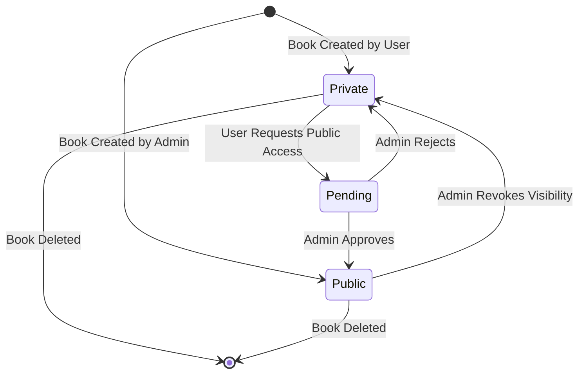
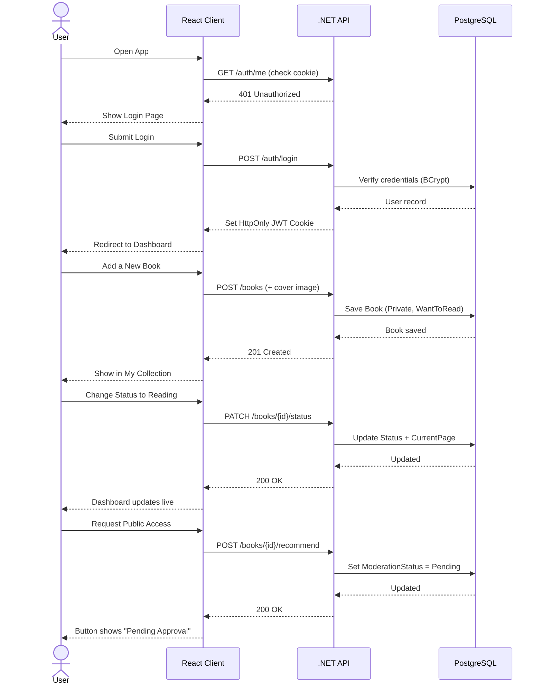
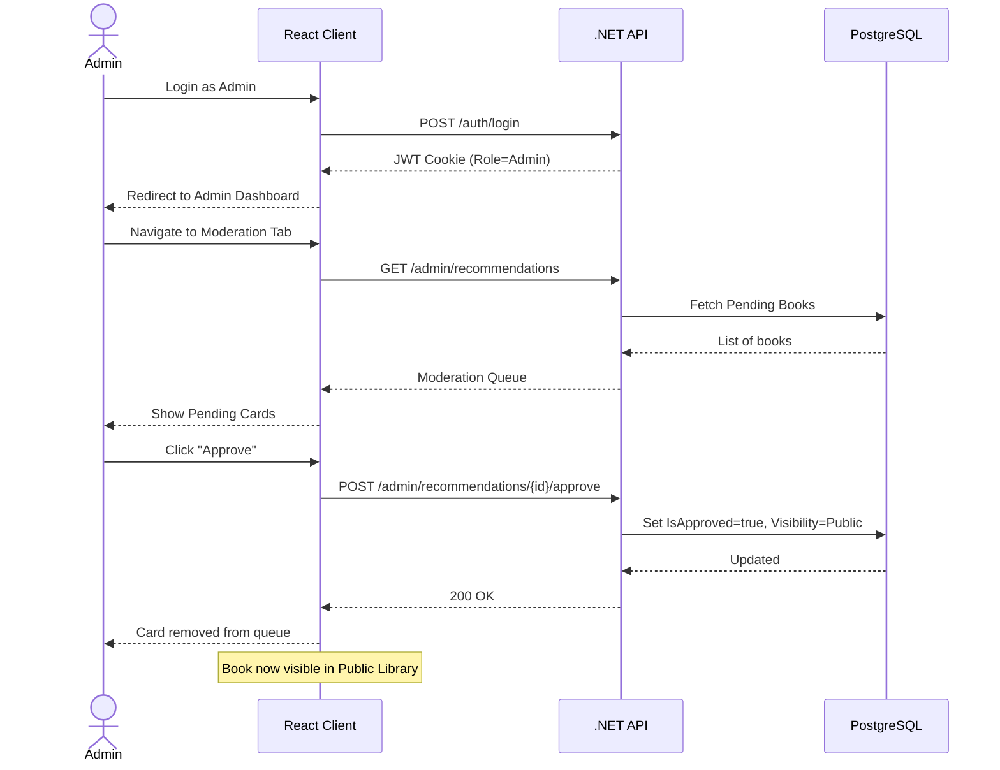

# Athenaeum Archive — User Flow Diagram

> **Product Perspective:** This diagram captures every user journey through the system — from initial landing to full book lifecycle management — ensuring no critical path is missed and all role boundaries are respected.  
> **Frontend Perspective:** These flows map directly to route guards, conditional renders, and state transitions in the React client.

---

## 1. Authentication Flow

---

## 2. User Dashboard & Reading Tracker Flow

---

## 3. Add Book Flow (User & Admin)

---

## 4. Admin Dashboard Flow

---

## 5. Book Visibility & Moderation State Machine

---

## 6. End-to-End Happy Path (Normal User)

---

## 7. End-to-End Happy Path (Admin Moderation)

---

*Generated by Lead Frontend + PM personas — Athenaeum Archive v1.0*
